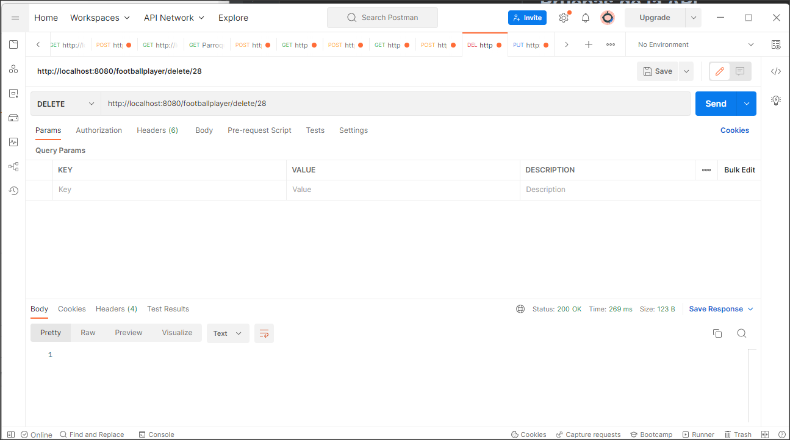

# Kruger Star Biblioteca

>Proyecto de Footbsll Player Testing

#   Pruebas de la API

## Listar de Api Football Player
> http://localhost:8080/footballplayer  lista todos los Footbal Player, GET

## Crear de Api Football Player
> http://localhost:8080/footballplayer/save, crea un Footbal Player, POST

## Editar de Api Football Player
> http://localhost:8080/footballplayer/update/28, modificar un Footbal Player, PUT

## Eliminar de Api Football Player
> http://localhost:8080/footballplayer/delete/28, eliminar un Footbal Player, DELETE

## Find by Id de Api Football Player
> http://localhost:8080/footballplayer/show/4, find by Id un Footbal Player, GET
